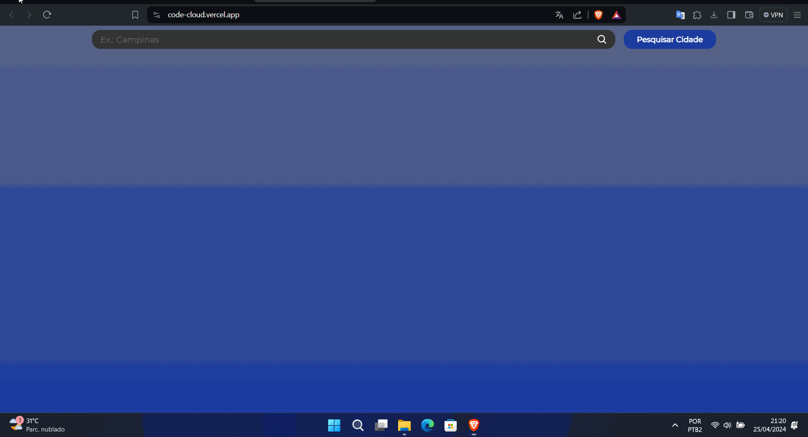

# Code Cloud

Aplicativo de previsao do tempo usando a [goweatherAPI](https://github.com/theovidal/goweather) atraves do FetchAPI. Pesquisando o nome de qualquer cidade e trazendo informaçoes sobre o clima de hoje e dos 3 dias seguintes.

[Link da aplicaçao](https://code-cloud.vercel.app/)
